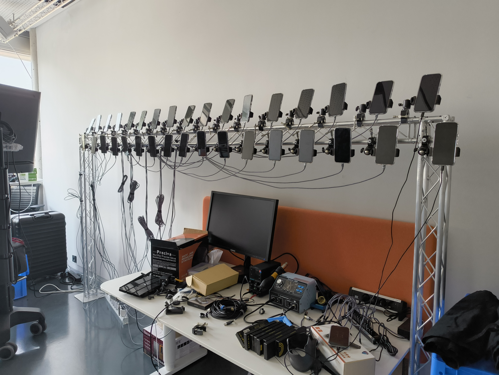

## INTRODUCTION
First of all, what was I tasked to do?

To improve the overall usability of the 35 phones used in the 4th project of the [VRinMotion](https://research.fhstp.ac.at/projekte/vrinmotion) research team of the UAS St.Pölten. Their project revolved around using those phones and an in house developed Android app to capture gaussian splats in order to record a stop motion dancer's performance which you would then be able to view in VR.

The initial state of the phones was that they were updated to Android 15, their bootloader was still locked and they where unrooted.

To be able to use the phones for the research project, they have to be set up (essentially from scratch) each time. That involves making sure they are connected to the correct wireless network, to the correct PC using wireless ADB and to the leader phone. While that doesn't sound like much, repeating those steps for every phone adds up to a lot of time. In addition to that, Android doesn't save any of those settings between device restarts, so those steps have to be repeated everytime the phone was turned off.

So, to rephrase the initial goal, ideally by the end of my 80h, was to see if it was possible to automate at least part of that set up process.

Furthermore, as previously mentioned, a while back the phones where updated to Android 15, which sadly introduced a couple of crashes into the setup, so that is something that will also need a bit of looking into.

## RESEARCH
The next steps on my side involved a lot of research into what could be done to make everyting easier and faster to setup.

After some googling, I determined with my supervisor, that best course of action will be to downgrade the phones to Android 14 and also root them in the process, so more can be done with them in the future.

Then, after looking up how to both downgrade and root an android device, it was time to do it myself.

## FIRST ATTEMPTS
Downgrading and rooting an Android device in 2025 is a lot easier then it used to be, which will come in handy when those steps will have to be repeated for every phone.

In short and without going to much into detail, what one has to do is, first unlock the bootloader, which can be done by putting the phone into fastboot mode while it is connected to a PC and then executing two commands, the downside to doing that is that it will reset the device, so in order to use it again you have to set it up again.

Thanks to an online tool by google themselves, the next step of downgrading the OS is very easy as you only have to follow the steps provided and by the end you are back on Android 14, albeit having to once again go through the set up process.

And lastly rooting, which only involves a few short steps of installing an app, modifying a file and executing a command while it is connected to a PC.

## TESTING
The next steps just involved testing to see if everything works as it should on the reconfigured phone and if any of the "old" crashes still occur. Additionally the code of the app was also slightly revised. By the end of all that, most of the major crashes could either be fixed or prevented from happening in the first place.

## 16/35 PHONES DONE
Near the end of my 80h it was time to repeat those same steps of unlocking, downgrading and rooting for about 15 more phone in order to be able to conduct larger tests and "recordings".

## FINISHING UP
To finish off, I compiled all my findings, notes and other related files into one cohesive git repository, for anyone involved in the project to read up on, should there ever be a need to repeat or continue what I had done so far.

---
Thanks for reading :)